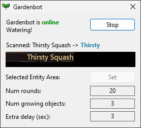

# Project Gorgon Gardening Bot

A Windows app to automate gardening in the Project Gorgon MMO.



With this you don't need to interact with the game every minute when gardening; more
likely every 20 minutes. It is called a gardenbot, but by the nature of gardening in
PG it's impossible to leave it running unattented. As so, it's not violating Project
Gorgon's ToC and should not get you banned (but I take no responsibility!).

You still need to react to unexpected situations in PG - other players gardening close
by, or NPCs running through. You need to keep an eye on it, but without the need for
interaction every minute it actually lets you focus on something else.

It's a little more than a simple `keypress + wait + keypress + repeat`, as it actually
detects your currently selected entity via screen reading and OCR, and only proceeds
gardening if it's a crop.

Tesseract-OCR is required as a separate app:
https://github.com/UB-Mannheim/tesseract/wiki#tesseract-at-ub-mannheim

Imagemagick is also required for enhancing the screenshots for better OCR results:
https://imagemagick.org/script/download.php

Currently the tesseract.exe is expected at
`C:\\Program Files\\Tesseract-OCR\\tesseract.exe` and imagemagick's convert.exe
at `C:\\Program Files\\ImageMagick\\convert.exe`. Those are hardcoded in `main.rs`.

The gardening bot is also simulating certain hardcoded keypresses. Those are inside
`grower.rs`.

Most of the code for taking screenshots (and selecting an area within - cropping) was
taken from https://github.com/nasso/screensnap.

## Building and running:

Easiest to cross-compile from Linux (or WSL on Windows?):

1. Install [Rust compiler](https://rustup.rs)
2. Build
```
$ cargo build --target x86_64-pc-windows-gnu --release
$ ls -lh target/x86_64-pc-windows-gnu/release/pg-gardenbot.exe
[...] 7.6M pg-gardenbot.exe
```
